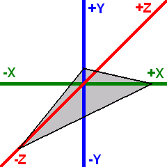

# Coordinate Systems

OmegaEngine uses a left-handed coordinate system (as used by DirectX) with the following default orientation:

- **Positive X axis** - Points to the right
- **Positive Y axis** - Points upward
- **Positive Z axis** - Points into the screen (away from the viewer)

The standard camera orientation is a view along the negative Z axis, looking into the positive Z direction.

## Terrain coordinates

The engine is able to render heightmap-based terrains with multiple blended surface textures and pre-calculated self-shadowing. Terrain data uses a specialized 2D coordinate system for heightmap and texture coordinates.

Coordinate system directed right-downwards (as used in graphics files). The standard orientation is a view along the positive Y axis.

These 2D coordinates map to the 3D engine coordinate system:

| Positive X axis | Width of the terrain  |
|-----------------|-----------------------|
| Positive Y axis | Height of the terrain |
| Negative Z axis | Depth of the terrain  |
