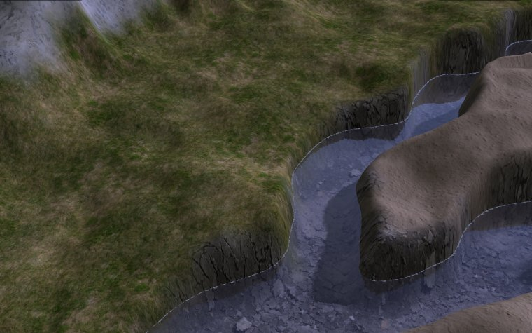
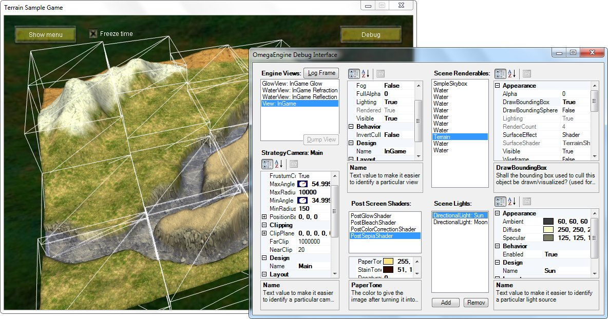
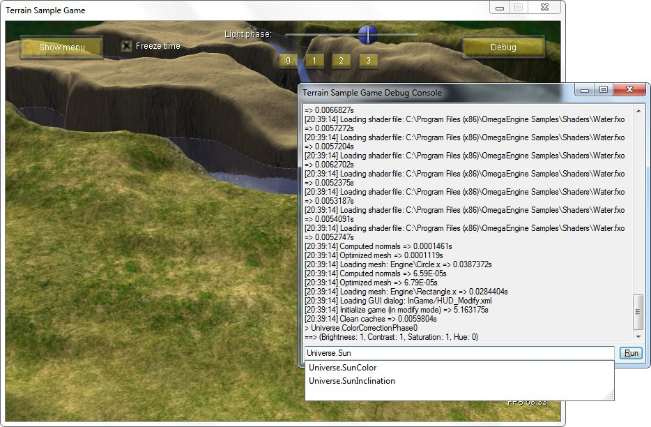
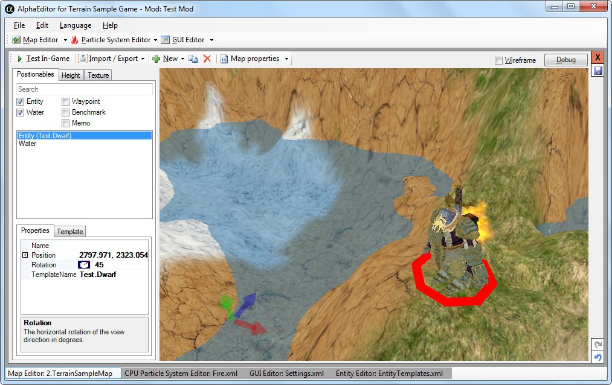
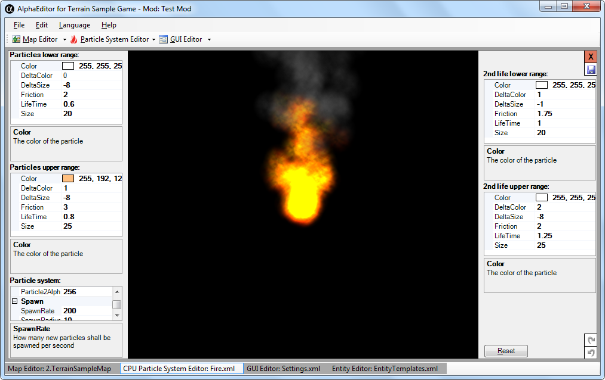
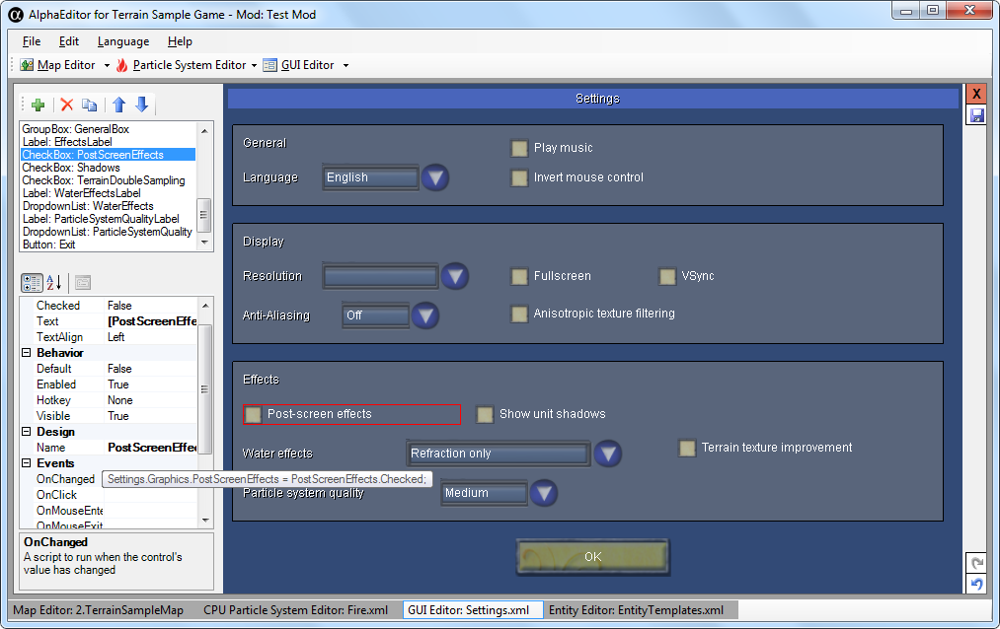
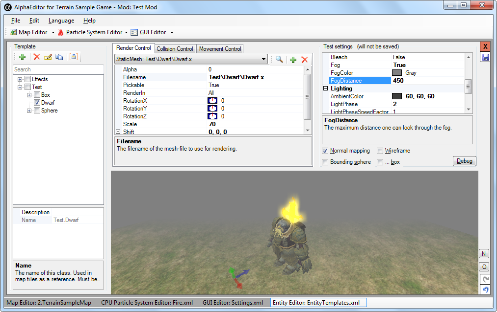

# Features

An overview of the engine's features:

  * [Scene management](scenes.md)
    * Multiple viewports
    * [64bit-precision object positioning](xref:OmegaEngine.Graphics.Cameras#floating-coordinate-system)
    * [Terrain rendering](terrain.md) (heightmap-based)
  * [HLSL shaders](xref:OmegaEngine.Graphics.Shaders)
    * DXSAS support
    * Post-screen effects
    * Dynamic shader generation
  * [Asset management](xref:OmegaEngine.Assets)
    * [Overlay filesystem](xref:OmegaEngine.Foundation.Storage#filesystem) with mod support
  * Effects
    * [Water with reflection and refraction](water.md)
    * [Glow](glow.md)
    * Particle systems (with WYSIWYG editor)
  * [GUI toolkit](xref:OmegaGUI)
    * XML file format (with WYSIWYG editor)
    * Lua scripting
  * [Render embedded in WinForms or standalone](hosting.md)
  * [Input system](xref:OmegaEngine.Input)

## Screenshots

### Terrain

**River**  

**Mountains**  

**Debug window (Bounding Box visualization enabled)**  

**Lua console (with auto-completion)**  

### Editor

**Map editor**  

**Particle system editor**  

**GUI/Menu editor (with Lua scripting)**  

**Entity editor (Fog enabled)**  

