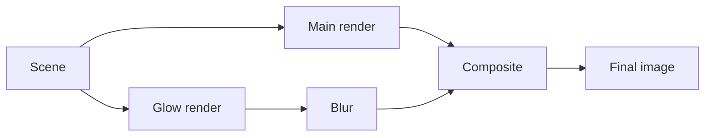

# Glow effect

The glow effect in OmegaEngine renders glowing elements separately, blurs them, and then composites them back onto the main [Scene](scenes.md). This creates an effect of bright lights "bleeding" over edges.

## Rendering passes

The glow effect uses a multi-pass rendering technique:

1. **Main render** - Render the scene normally
2. **Glow render** - Render the scene a second time to a separate texture capturing only glowing materials (<xref:OmegaEngine.Graphics.GlowView>)
3. **Blur** - Apply a blur shader to the glow map to create the bloom spread (<xref:OmegaEngine.Graphics.Shaders.PostBlurShader>)
4. **Composite** - Add the blurred glow map on top of the main scene (<xref:OmegaEngine.Graphics.Shaders.PostGlowShader>)



## Setup

To enable the glow effect, call [View.SetupGlow()](xref:OmegaEngine.Graphics.View.SetupGlow(System.Single,System.Single)). This automatically creates and registers the necessary views and shaders.

```csharp
var view = new View(scene, camera)
{
    Name = "Main View",
    Lighting = true
};
engine.Views.Add(view);
view.SetupGlow(
    blurStrength: 3.0,
    glowStrength: 1.0
);
```

## Marking objects as glowing

Objects contribute to the glow effect through their materials:

### Glow color

Set the <xref:OmegaEngine.Graphics.XMaterial.Glow> color property on a material to make it glow. The color defines which color the object emits in the glow pass.

```csharp
var model = new Model(XMesh.Get(engine, "Lamp.x"));
model.Materials[0].Glow = Color.Yellow;
```

### Glow map

Use a <xref:OmegaEngine.Graphics.XMaterial.GlowMap> texture to define which parts of a model should glow and with what intensity. Bright areas in the glow map will appear in the glow pass.

```csharp
var model = new Model(XMesh.Get(engine, "Lamp.x"));
model.Materials[0].GlowMap = XTexture.Get(engine, "LampGlow.png");
```
