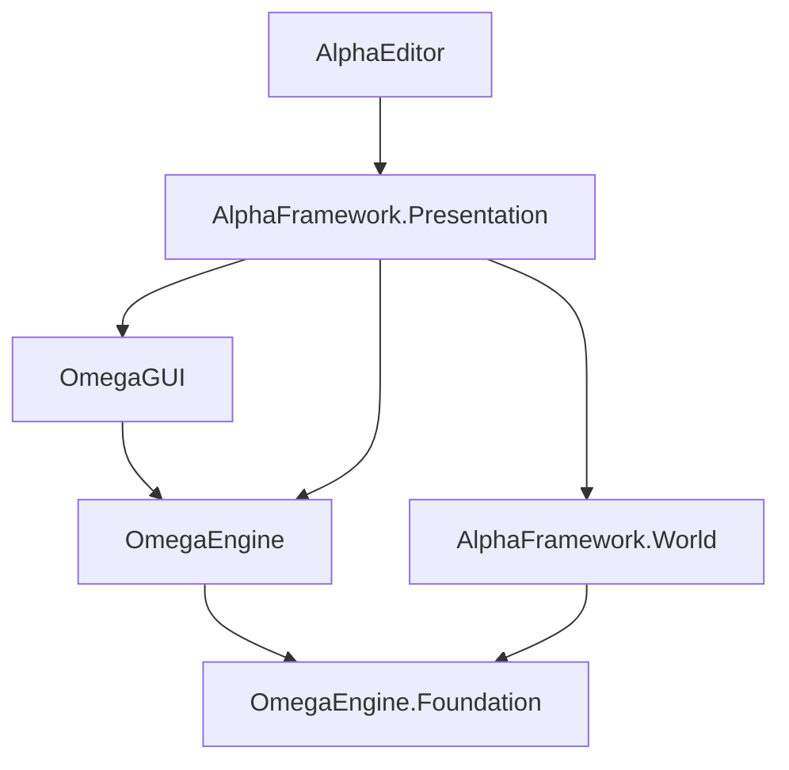

<xref:OmegaEngine> is a general-purpose 3D graphics for .NET Framework and DirectX 9. The engine is designed to be light-weight, modular and gameplay-agnostic. It is designed to be:

 * light-weight (core engine including dependencies < 8MB),
 * modular (use only the parts you need for your project) and
 * gameplay-agnostic (also suitable for visualization projects, etc.).

<xref:OmegaGUI> is a GUI toolkit for OmegaEngine with an XML file format und Lua scripting.  
The AlphaEditor contains a WYSIWYG editor for the toolkit.

<xref:AlphaFramework> is a complementary framework for OmegaEngine.  
It provides base classes for designing a game world using the Model-View-Presenter pattern.

<xref:FrameOfReference> is the official sample game for OmegaEngine.  
It is intended as a sample/reference for developers working on other games.

## Prerequisites

You must install these components before you can use OmegaEngine:

- [Visual C++ 2010 Redistributable x86](https://www.microsoft.com/en-us/download/details.aspx?id=26999)
- [DirectX June 2010 Runtime](https://www.microsoft.com/en-us/download/details.aspx?id=8109)
- [Visual Studio 2022 v17.13 or newer](https://www.visualstudio.com/downloads/)

## First steps

Create a WinForms project targetting .NET Framework 4.7.2 or newer with the platform set to `x86`.  
Add a reference to the NuGet package `OmegaEngine`. Then add the following code to render a textured sphere:

```csharp
var engine = new Engine(this, new EngineConfig { TargetSize = ClientSize });
var scene = new Scene
{
    Positionables = { Model.Sphere(engine, XTexture.Get(engine, "flag.png")) }
};
var view = new View(scene, new TrackCamera()) { BackgroundColor = Color.CornflowerBlue };
engine.Views.Add(view);

Paint += delegate { engine.Render(); };
```

## NuGet packages

| Package                                                                                    | Namespace                          | Description                                                          |
| ------------------------------------------------------------------------------------------ | ---------------------------------- | -------------------------------------------------------------------- |
| [OmegaEngine](https://www.nuget.org/packages/OmegaEngine/)                                 | <xref:OmegaEngine>                 | 3D graphics rendering based on DirectX 9.                            |
| [OmegaEngine.Foundation](https://www.nuget.org/packages/OmegaEngine.Foundation/)           | <xref:OmegaEngine.Foundation>      | Rendering-agnostic infrastructure like storage  and data structures. |
| [OmegaGUI](https://www.nuget.org/packages/OmegaGUI/)                                       | <xref:OmegaGUI>                    | GUI toolkit with XML file format und Lua scripting.                  |
| [AlphaFramework.World](https://www.nuget.org/packages/AlphaFramework.World/)               | <xref:AlphaFramework.World>        | Basis for engine-agnostic models of game worlds.                     |
| [AlphaFramework.Presentation](https://www.nuget.org/packages/AlphaFramework.Presentation/) | <xref:AlphaFramework.Presentation> | Basis for presenters that visualize game worlds using the engine.    |
| [AlphaEditor](https://www.nuget.org/packages/AlphaEditor/)                                 | <xref:AlphaFramework.Editor>       | Toolkit for creating editors for games based on AlphaFramework.      |

**Dependencies**



## Project templates

The OmegaEngine [project templates](https://www.nuget.org/packages/OmegaEngine.Templates#readme-body-tab) help you create C# projects that use OmegaEngine, OmegaGUI and AlphaFramework.
