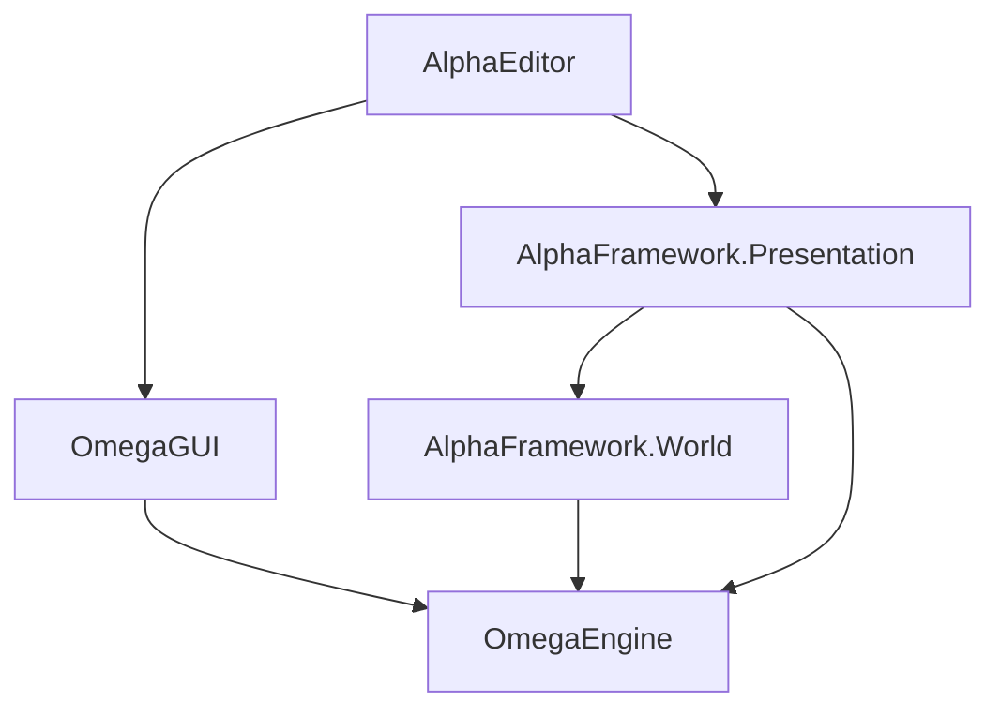

# OmegaEngine API docs

<xref:OmegaEngine> is a general-purpose 3D graphics engine written in C# using the .NET Framework 4.7.2 and DirectX 9. The engine is designed to be light-weight, modular and gameplay-agnostic.

<xref:OmegaGUI> is a skinable GUI toolkit for the OmegaEngine with an XML file format und Lua scripting.  
The AlphaEditor contains a WYSIWYG editor for the toolkit.

<xref:AlphaFramework> is a complementary framework for the OmegaEngine.  
It provides base classes for designing a game world using the Model-View-Presenter pattern.

<xref:FrameOfReference> is the official sample game for the OmegaEngine.  
It is intended as a sample/reference for developers working on other games.

## NuGet packages

| Package                                                                                    | Namespace                          | Description                                          |
| ------------------------------------------------------------------------------------------ | ---------------------------------- | ---------------------------------------------------- |
| [OmegaEngine](https://www.nuget.org/packages/OmegaEngine/)                                 | <xref:OmegaEngine>                 | The main package.                                    |
| [OmegaGUI](https://www.nuget.org/packages/OmegaGUI/)                                       | <xref:OmegaGUI>                    | The GUI toolkit.                                     |
| [AlphaFramework.World](https://www.nuget.org/packages/AlphaFramework.World/)               | <xref:AlphaFramework.World>        | Used to build Engine-agnostic models of game worlds. |
| [AlphaFramework.Presentation](https://www.nuget.org/packages/AlphaFramework.Presentation/) | <xref:AlphaFramework.Presentation> | Renders models using engine renderables.             |
| [AlphaEditor](https://www.nuget.org/packages/AlphaEditor/)                                 | <xref:AlphaFramework.Editor>       | IDE-like editor for AlphaFramework games.            |

### Dependencies

```mermaid
flowchart TD
    engine[OmegaEngine]
    gui[OmegaGUI] --> engine
    world[AlphaFramework.World] --> engine
    presentation[AlphaFramework.Presentation] --> world
    presentation --> engine
    editor[AlphaEditor] --> presentation
    editor --> gui
```
