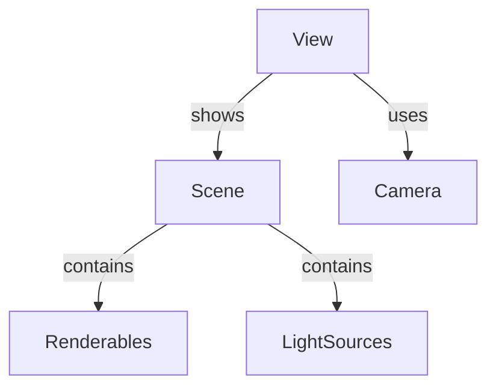
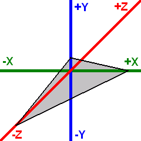

# Scenes

A **<xref:OmegaEngine.Graphics.Scene>** contains all the objects to be rendered. It manages collections of renderables and light sources.

**[Renderables](xref:OmegaEngine.Graphics.Renderables)** are objects that can be rendered by the engine, such as models, [terrain](terrain.md), particle systems, or skyboxes.

**[Light sources](xref:OmegaEngine.Graphics.LightSources)** illuminate renderables in the scene.

**[Cameras](xref:OmegaEngine.Graphics.Cameras)** determines the perspective from which a scene is viewed. They define the position, orientation, and projection parameters.

A **<xref:OmegaEngine.Graphics.View>** represents a viewport with a specific scene and camera. The view handles rendering and can apply <xref:OmegaEngine.Graphics.Shaders.PostShader>s to the final output. Multiple views can render the same scene with different cameras.



## Coordinate system

OmegaEngine uses a left-handed coordinate system (as used by DirectX) with the following default orientation:

- **Positive X axis** - Points to the right
- **Positive Y axis** - Points upward
- **Positive Z axis** - Points into the screen (away from the viewer)

The standard camera orientation is a view along the negative Z axis, looking into the positive Z direction.



## Setup

Basic example of setting up a scene with a model and lighting:

```csharp
var scene = new Scene
{
    Positionables =
    {
        new Model(XMesh.Get(engine, "MyModel.x"))
    },
    Lights =
    {
        new DirectionalLight { Direction = new(-1, -1, 1), Diffuse = Color.White }
    }
};

var camera = new FreeFlyCamera
{
    Position = new(0, 10, -20)
};

var view = new View(scene, camera) { Lighting = true };
engine.Views.Add(view);
```
