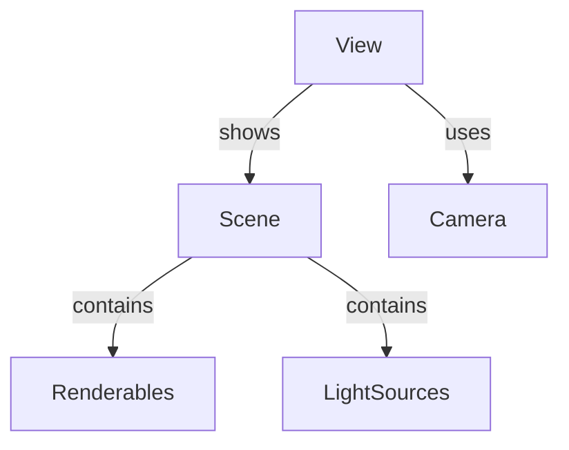

# Scenes

A **<xref:OmegaEngine.Graphics.Scene>** contains all the objects to be rendered. It manages collections of <xref:OmegaEngine.Graphics.Renderables>s and <xref:OmegaEngine.Graphics.LightSources>.

**<xref:OmegaEngine.Graphics.Renderables>** are objects that can be rendered by the engine, such as models, terrain, particle systems, or skyboxes.

**<xref:OmegaEngine.Graphics.LightSources>** illuminate renderables in the scene.

**<xref:OmegaEngine.Graphics.Cameras>** determines the perspective from which a scene is viewed. They define the position, orientation, and projection parameters.

A **<xref:OmegaEngine.Graphics.View>** represents a viewport *with a specific scene and camera*. The view handles rendering and can apply <xref:OmegaEngine.Graphics.Shaders.PostShader>s to the final output. Multiple views can render the same scene with different cameras.


```mermaid
graph TD
    Scene -- contains --> Renderables
    Scene -- contains --> LightSources
    View -- shows --> Scene
    View -- uses --> Camera
```

## Usage example

Here's a basic example of setting up a scene with a model and lighting:

```csharp
var scene = new Scene
{
    Positionables =
    {
        Model.FromContent(engine, "Models/MyModel.x")
    },
    Lights =
    {
        new DirectionalLight { Direction = new(-1, -1, 1), Diffuse = Color.White }
    }
};

var camera = new FreeFlyCamera()
{
    Position = new(0, 10, -20)
};

var view = new View(scene, camera) { Lighting = true };
engine.Views.Add(view);
```
