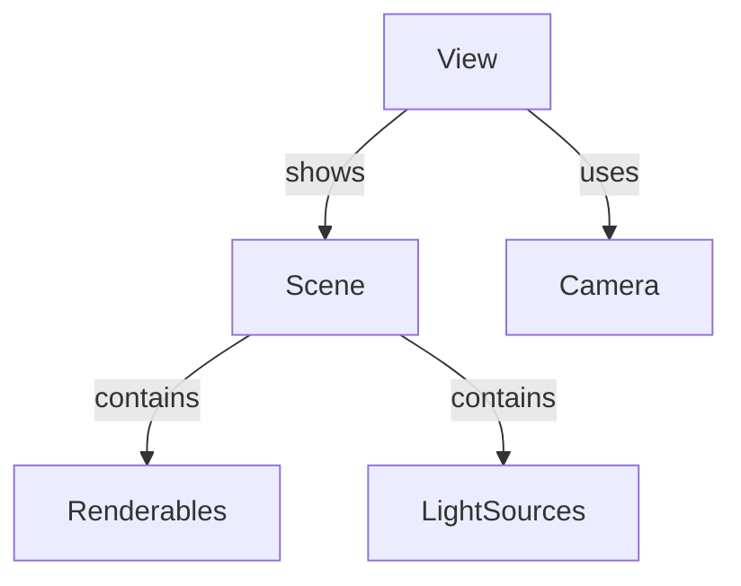
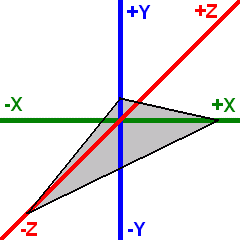

# Scenes

A **<xref:OmegaEngine.Graphics.Scene>** contains all the objects to be rendered. It manages collections of renderables and light sources.

**[Renderables](xref:OmegaEngine.Graphics.Renderables)** are objects that can be rendered by the engine, such as models, [terrain](terrain.md), particle systems, or skyboxes.

**[Light sources](xref:OmegaEngine.Graphics.LightSources)** illuminate renderables in the scene.

**[Cameras](xref:OmegaEngine.Graphics.Cameras)** determines the perspective from which a scene is viewed. They define the position, orientation, and projection parameters.

A **<xref:OmegaEngine.Graphics.View>** represents a viewport with a specific scene and camera. The view handles rendering and can apply <xref:OmegaEngine.Graphics.Shaders.PostShader>s to the final output. Multiple views can render the same scene with different cameras.


```mermaid
graph TD
    Scene -- contains --> Renderables
    Scene -- contains --> LightSources
    View -- shows --> Scene
    View -- uses --> Camera
```

## Coordinate system

OmegaEngine uses a left-handed coordinate system (as used by DirectX) with the following default orientation:

- **Positive X axis** - Points to the right
- **Positive Y axis** - Points upward
- **Positive Z axis** - Points into the screen (away from the viewer)

The standard camera orientation is a view along the negative Z axis, looking into the positive Z direction.



## Setup

Basic example of setting up a scene with a model and [lighting](lighting.md):

```csharp
var scene = new Scene
{
    Positionables =
    {
        new Model(XMesh.Get(engine, "MyModel.x"))
    },
    Lights =
    {
        new DirectionalLight { Direction = new(-1, -1, 1), Diffuse = Color.White }
    }
};

var camera = new FreeFlyCamera
{
    Position = new(0, 10, -20)
};

var view = new View(scene, camera) { Lighting = true };
engine.Views.Add(view);
```

## Render hierarchy

<xref:OmegaEngine.Graphics.Scene.Positionables> holds the _roots_ of the scene. Every <xref:OmegaEngine.Graphics.Renderables.PositionableRenderable> in turn has a `Children` collection, so renderables can be grouped under a shared transform. <xref:OmegaEngine.Graphics.Renderables.Pivot> is a renderable without geometry meant purely for grouping.

```csharp
var ship = new Pivot { Position = new(0, 0, 100) };
ship.Children.Add(new Model(XMesh.Get(engine, "Hull.x")));
ship.Children.Add(new Model(XMesh.Get(engine, "Engine.x")) { Position = new(0, 0, -5) });
scene.Positionables.Add(ship);
```

A root's `Position` is absolute world space, a child's `Position` is an offset in its parent's coordinate system. `WorldPosition` always gives the absolute position.

Adding a renderable to a collection removes it from its previous one and keeps its local `Position`, `Rotation`, `Scale` and `PreTransform`, i.e. its world position changes to match the new parent.

Rotation, scale and `PreTransform` are inherited in full, so non-uniform scaling on a parent combined with a rotated child produces shear.

`Billboard`, `ForcedPerspectiveDistance` and `AutoScaleDistance` are per-view effects applied to leaf nodes only; they have no effect while a renderable has children.

<xref:OmegaEngine.Graphics.LightSources.PointLight> and <xref:OmegaEngine.Audio.Sound3D> can follow a renderable instead of holding an absolute position: set `AttachedTo` and give them a local `Offset`.
