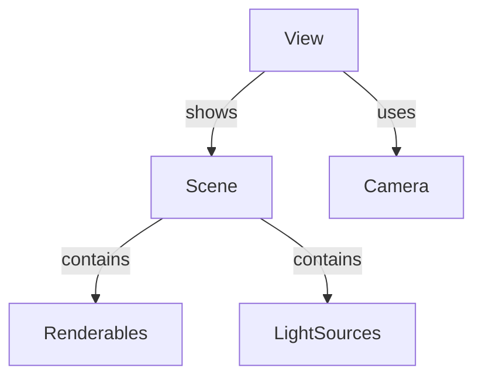
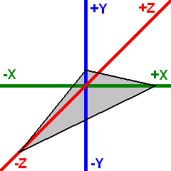

# Scenes

A **<xref:OmegaEngine.Graphics.Scene>** contains all the objects to be rendered. It manages collections of renderables and light sources.

**[Renderables](xref:OmegaEngine.Graphics.Renderables)** are objects that can be rendered by the engine, such as models, [terrain](terrain.md), particle systems, or skyboxes.

**[Light sources](xref:OmegaEngine.Graphics.LightSources)** illuminate renderables in the scene.

**[Cameras](xref:OmegaEngine.Graphics.Cameras)** determines the perspective from which a scene is viewed. They define the position, orientation, and projection parameters.

A **<xref:OmegaEngine.Graphics.View>** represents a viewport with a specific scene and camera. The view handles rendering and can apply <xref:OmegaEngine.Graphics.Shaders.PostShader>s to the final output. Multiple views can render the same scene with different cameras.


```mermaid
graph TD
    Scene -- contains --> Renderables
    Scene -- contains --> LightSources
    View -- shows --> Scene
    View -- uses --> Camera
```

## Coordinate system

OmegaEngine uses a left-handed coordinate system (as used by DirectX) with the following default orientation:

- **Positive X axis** - Points to the right
- **Positive Y axis** - Points upward
- **Positive Z axis** - Points into the screen (away from the viewer)

The standard camera orientation is a view along the negative Z axis, looking into the positive Z direction.



## Setup

Basic example of setting up a scene with a model and [lighting](lighting.md):

```csharp
var scene = new Scene
{
    Positionables =
    {
        new Model(XMesh.Get(engine, "MyModel.x"))
    },
    Lights =
    {
        new DirectionalLight { Direction = new(-1, -1, 1), Diffuse = Color.White }
    }
};

var camera = new FreeFlyCamera
{
    Position = new(0, 10, -20)
};

var view = new View(scene, camera) { Lighting = true };
engine.Views.Add(view);
```

## Render hierarchy

<xref:OmegaEngine.Graphics.Scene.Positionables> holds the _roots_ of the scene. Every <xref:OmegaEngine.Graphics.Renderables.PositionableRenderable> in turn has a `Children` collection, so renderables can be grouped under a shared transform.

A root's `Position` is absolute world space, a child's `Position` is an offset in its parent's coordinate system. `WorldPosition` always gives the absolute position.

```csharp
scene.Positionables.Add(new Model(XMesh.Get(engine, "Spaceship.x"))
{
    Position = new(0, 0, 100),
    Children =
    {
        new Model(XMesh.Get(engine, "Engine.x")) { Position = new(0, 0, -5) }
    }
});
```

<xref:OmegaEngine.Graphics.Renderables.Pivot> is a renderable without geometry meant purely for grouping.

```csharp
scene.Positionables.Add(new Pivot
{
    Position = new(0, 0, 100),
    Children =
    {
        new Model(XMesh.Get(engine, "Hull.x")),
        new Model(XMesh.Get(engine, "Engine.x")) { Position = new(0, 0, -5) }
    }
});
```

Adding a renderable to a collection removes it from its previous one and keeps its local `Position`, `Rotation`, `Scale` and `PreTransform`, i.e. its world position changes to match the new parent.

Rotation, scale and `PreTransform` are inherited in full, so non-uniform scaling on a parent combined with a rotated child produces shear.

Setting `Visible = false` on a renderable hides it together with its entire subtree.

<xref:OmegaEngine.Graphics.LightSources.PointLight> and <xref:OmegaEngine.Audio.Sound3D> can follow a renderable instead of holding an absolute position: set `AttachedTo` and give them a local `Offset`.

## Camera-dependent effects

Some properties of <xref:OmegaEngine.Graphics.Renderables.PositionableRenderable> adjust how a renderable is drawn based on its relation to the camera. They are evaluated per view, so a renderable shown by multiple views with different cameras is adjusted separately for each of them. They only affect rendering; the renderable's `Position`, `Rotation` and `Scale` stay unchanged.

### Billboard

<xref:OmegaEngine.Graphics.Renderables.PositionableRenderable.Billboard> rotates a renderable to face the camera, which is useful for flat sprites such as sun flares, labels or impostors standing in for distant geometry. The <xref:OmegaEngine.Graphics.Renderables.BillboardMode> controls how:

- **Spherical**: The renderable always faces the camera fully, regardless of the camera's elevation.
- **Cylindrical**: The renderable only rotates around its vertical axis, so it stays upright, e.g. for trees or characters.

This applies to leaf nodes only; it has no effect while a renderable has children.

### Auto scale

<xref:OmegaEngine.Graphics.Renderables.PositionableRenderable.AutoScaleDistance> keeps distant renderables from shrinking to nothing on screen. While closer to the camera than this distance, a renderable is drawn at its natural size. Farther away, it is scaled up so that it never appears smaller than it would at this distance, i.e. its apparent size (angular diameter) stays constant. This is useful for objects that should remain visible and selectable at any distance, such as markers or units on a strategic map.

The scaling is applied on top of `Scale` and is reflected in the bounding bodies used for culling.

This applies to leaf nodes only; it has no effect while a renderable has children.

### Forced perspective

<xref:OmegaEngine.Graphics.Renderables.PositionableRenderable.ForcedPerspectiveDistance> lets very distant objects, such as planets or moons, be shown in a scene without pushing the camera's <xref:OmegaEngine.Graphics.Cameras.Camera.FarClip> out so far that depth buffer precision suffers. Renderables farther away than this distance are pulled in closer to the camera and scaled down correspondingly, so their outline on screen is unchanged and only their depth differs.

Unlike `Billboard` and `AutoScaleDistance`, this applies to a renderable together with all its children, which are pulled in alike and stay in place relative to each other. It is measured to the surface of the subtree's bounding sphere, so no part of the subtree is rendered closer than this distance, unless the subtree has to be pulled in further to keep its far side within `FarClip`.

Renderables beyond `ForcedPerspectiveDistance` are pulled in logarithmically, which keeps pulled-in renderables at clearly different distances in the right Z-order. This is not guaranteed for renderables whose depth ranges overlap, since each subtree is scaled as a whole by a factor measured to its own nearest surface, nor for subtrees pulled in further to fit within `FarClip`. They are spread across the depth range between `ForcedPerspectiveDistance` and `FarClip`, so leave enough room between the two.

Fog is applied at the distance a renderable is rendered at, not the one it actually has. Pulled-in renderables are therefore usually fogged less than their actual distance would call for, and more distant ones get more fog as they approach `FarClip`. If `FarClip` is set to the fog's end distance, the most distant renderables fade almost completely into the fog.

`ForcedPerspectiveDistance` can be combined with `AutoScaleDistance` for very large, very distant objects that should also stay visible.
