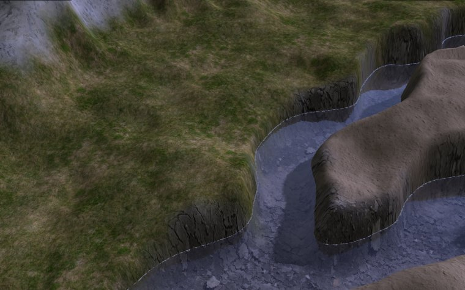
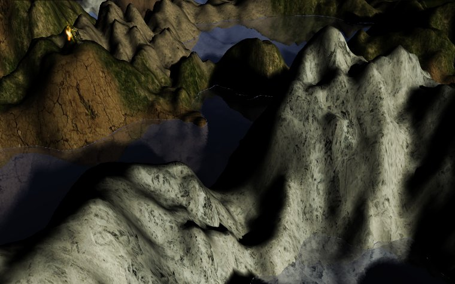
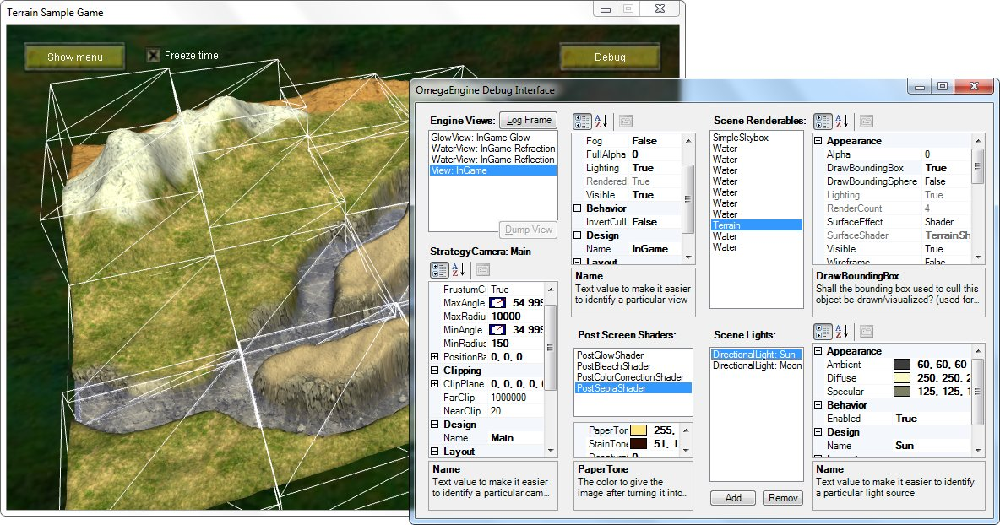
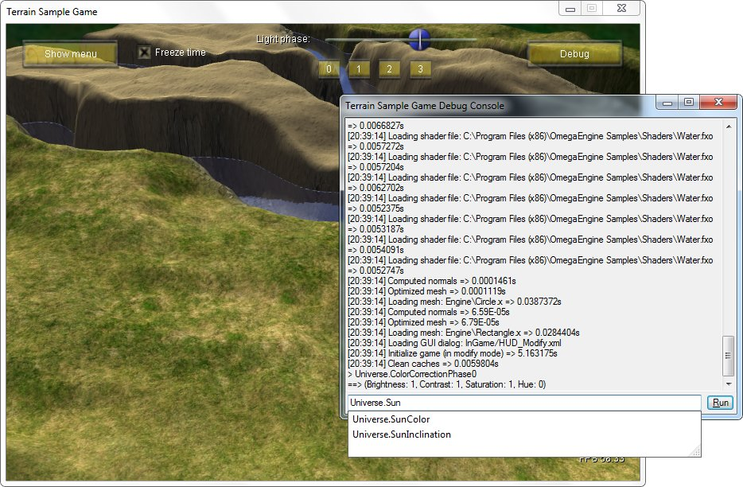
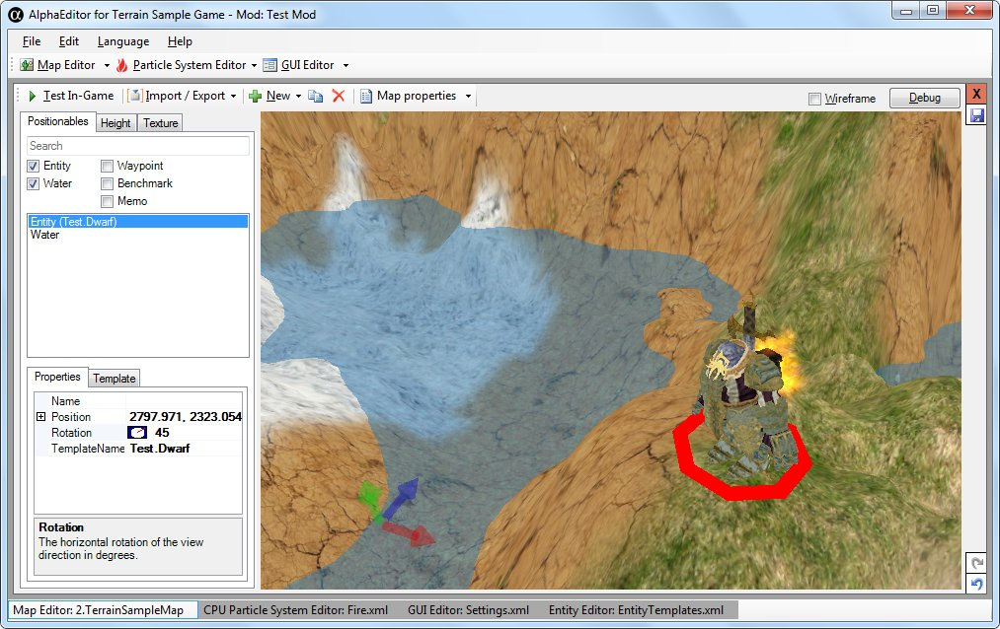
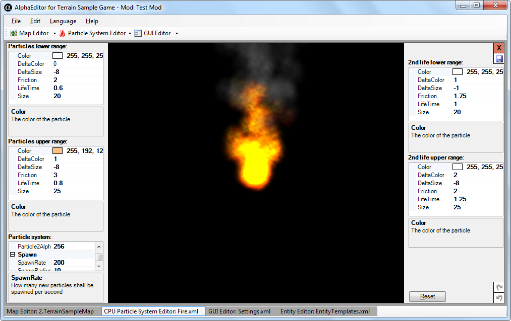
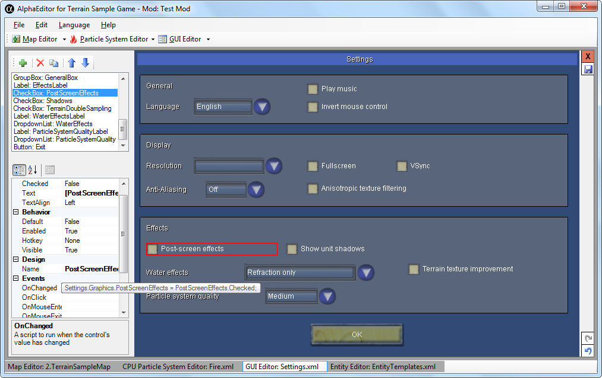
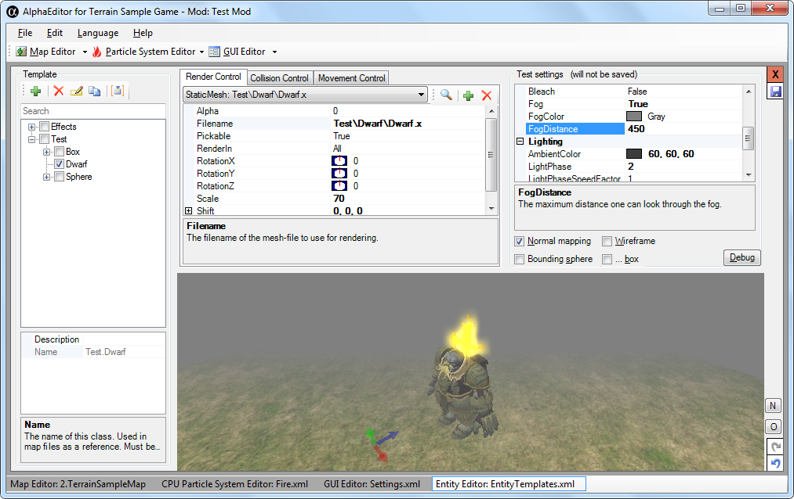

# Screenshots

## Terrain Sample

### River

### Mountains

### Debug window (Bounding Box visualization enabled)

### Lua console (with auto-completion)

## Editor

### Map editor

### Particle system editor

### GUI/Menu editor (with Lua scripting)

### Entity editor (Fog enabled)

