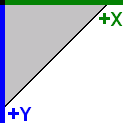

# Terrain

OmegaEngine supports heightmap-based terrain rendering with multiple blended surface textures and pre-calculated self-shadowing.

The <xref:OmegaEngine.Graphics.Renderables.Terrain> class renders heightmap-based terrains. The terrain is divided into blocks for efficient culling and rendering.

<xref:AlphaFramework.World.Terrains> provides tools for terrain generation, editing, and storage.

## Coordinates

Terrain data uses a 2D coordinate system for heightmap and texture data. This coordinate system is directed right-downwards (as used in graphics files).

These 2D coordinates map to the [3D engine coordinate system](scenes.md#coordinate-system):

| Axis            | Terrain Dimension     |
|-----------------|-----------------------|
| Positive X axis | Width of the terrain  |
| Positive Y axis | Height of the terrain |
| Negative Z axis | Depth of the terrain  |
