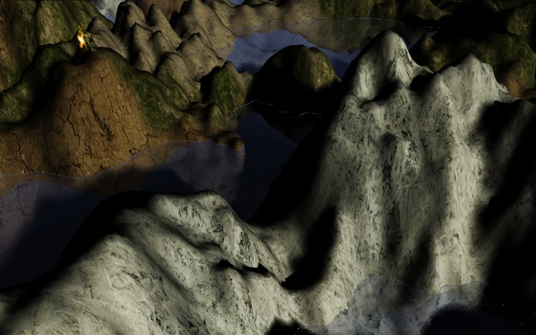
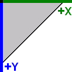

# Terrain

OmegaEngine supports heightmap-based terrain rendering with multiple blended surface textures and pre-calculated self-shadowing.

The <xref:OmegaEngine.Graphics.Renderables.Terrain> class renders heightmap-based terrains.

<xref:AlphaFramework.World.Terrains> provides tools for terrain generation, editing, and storage.

## Height map

The height map is a 2D grid of elevation values that defines the terrain's shape. Each value in the grid represents the elevation at that specific location on the terrain. Height maps are stored as byte grids (values 0-255). The horizontal scale of each sample is controlled by <xref:AlphaFramework.World.Terrains.TerrainSize.StretchH>, and the vertical (elevation) scale is controlled by <xref:AlphaFramework.World.Terrains.TerrainSize.StretchV>. Terrain dimensions must be multiples of 3.

In AlphaFramework, the height map is accessed via <xref:AlphaFramework.World.Terrains.ITerrain.HeightMap>. The data is typically loaded from external files for efficient storage.

## Textures

The texture map defines which texture to use at each location on the terrain. Multiple textures can be blended together to create smooth transitions between different terrain types (e.g., grass, rock, sand).

AlphaFramework uses texture templates (<xref:AlphaFramework.World.Templates.Template`1>) to map texture indices to actual textures. The <xref:AlphaFramework.World.Terrains.ITerrain.TextureMap> stores indices that reference these templates, allowing efficient reuse of texture definitions across the terrain. The texture map is stored at 1/3 the resolution of the height map: each texture cell covers a 3×3 block of height map samples.

When <xref:OmegaEngine.EngineEffects.DoubleSampling> is enabled (via <xref:AlphaFramework.Presentation.Config.GraphicsSettings.DoubleSampling>), terrain textures are sampled twice with different texture coordinates and blended together. This technique provides better image quality by reducing repetitive tiling patterns that can occur when the same texture is repeated across large terrain areas.

## Shadowing

The occlusion interval map provides pre-calculated self-shadowing data. This map stores information about which parts of the terrain cast shadows on other parts, based on the terrain's geometry. This approach allows for efficient rendering of terrain shadows without real-time shadow calculations.

The <xref:AlphaFramework.World.Terrains.ITerrain.OcclusionIntervalMap> can be generated using <xref:AlphaFramework.World.Terrains.OcclusionIntervalMapGenerator>.

## Coordinates

Terrain data uses a 2D coordinate system for heightmap and texture data. This coordinate system is directed right-downwards (as used in graphics files).

These 2D coordinates map to the [3D engine coordinate system](scenes.md#coordinate-system):

| Axis            | Terrain Dimension     |
|-----------------|-----------------------|
| Positive X axis | Width of the terrain  |
| Positive Y axis | Height of the terrain |
| Negative Z axis | Depth of the terrain  |
