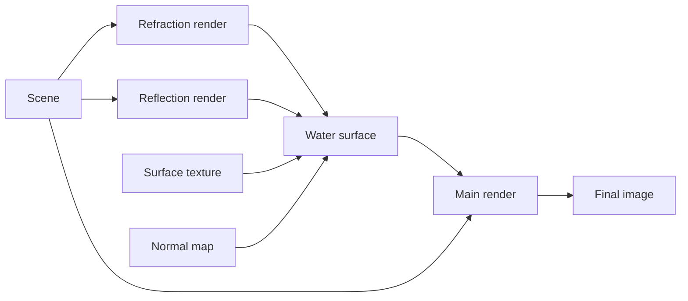

# Water

OmegaEngine provides water rendering with reflections and refractions.


## Rendering passes

Water rendering uses a multi-pass rendering technique:

1. **Refraction render** - Renders the scene parts below the water surface, creating the refraction effect (what you see through the water)
2. **Reflection render** - Renders the scene parts above the water surface with a mirrored camera, creating the reflection effect (what's reflected on the water surface)
3. **Water surface** - Renders the water plane itself, combining the refracted and reflected views with a scrolling surface texture and normal map (<xref:OmegaEngine.Graphics.Shaders.WaterShader>)
4. **Main render** - Render the scene normally, including the water surface



## Setup

To enable the water effect, call [Water.SetupChildViews()](xref:OmegaEngine.Graphics.Renderables.Water.SetupChildViews(OmegaEngine.Graphics.View,System.Single)). This automatically creates and registers the necessary views.

```csharp
var water = new Water(engine, size: new(1000, 1000))
{
    Position = new(0, 5, 0), // Y = water height
    Name = "Lake"
};
scene.Positionables.Add(water);

water.SetupChildViews(view, clipTolerance: 2.0);
```

> [!TIP]
> `clipTolerance` determines how far to shift the clip plane along its normal vector. Increase this value if you see graphical glitches at water edges.

> [!WARNING]
> Avoid placing multiple water planes at different heights within a single scene. Water planes at the same height share the same refraction and reflection render passes. However, water planes at different heights require additional render passes, which negatively impacts performance.
