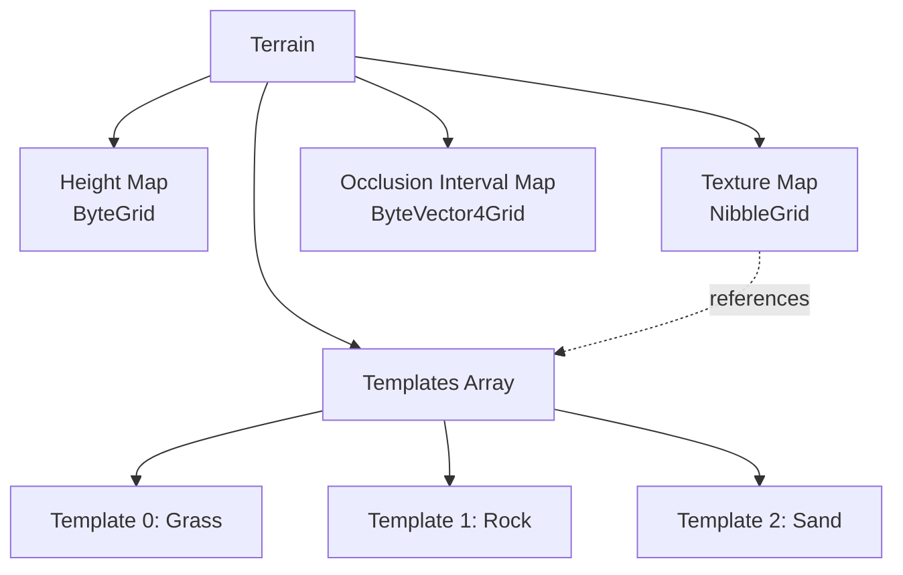

TODO: review

AlphaFramework's terrain system stores terrain data in a serializable format using <xref:AlphaFramework.World.Terrains.Terrain`1>. This allows terrain to be saved, loaded, and edited without requiring the rendering engine.

## Terrain Data Structure

The terrain system uses several components:

- **<xref:AlphaFramework.World.Terrains.ITerrain.HeightMap>** - A 2D grid of elevation values (byte values 0-255)
- **<xref:AlphaFramework.World.Terrains.ITerrain.TextureMap>** - Indices into the texture templates array, defining which texture to use at each location
- **<xref:AlphaFramework.World.Terrains.ITerrain.OcclusionIntervalMap>** - Pre-calculated self-shadowing data
- Array of **<xref:AlphaFramework.World.Templates.TerrainTemplateBase`1>** - Objects that map texture indices to actual texture file paths



TODO: Describe deriving from `TerrainTemplateBase<>`

## Converting to Renderable

Use the <xref:AlphaFramework.Presentation.TerrainExtensions.ToRenderable``1(AlphaFramework.World.Terrains.Terrain{``0},OmegaEngine.Engine,System.Boolean,System.Int32)> extension method to convert terrain data to a renderable format:

```csharp
// Load or create terrain data
var terrain = new Terrain<TerrainTemplate>
{
    Size = new TerrainSize(300, 300) { StretchH = 2.5f, StretchV = 0.5f }
};
terrain.LoadHeightMap("Maps/heightmap.dat");
terrain.LoadTextureMap("Maps/texturemap.dat");

// Define texture templates
terrain.Templates[0] = new TerrainTemplate { Name = "Grass", Texture = "grass.png" };
terrain.Templates[1] = new TerrainTemplate { Name = "Rock", Texture = "rock.png" };

// Convert to renderable for OmegaEngine
var renderable = terrain.ToRenderable(engine, lighting: true, blockSize: 32);
scene.Positionables.Add(renderable);
```

## Terrain Templates

Templates associate texture indices in the texture map with actual texture files. This allows the texture map to use compact indices (nibbles, 0-15) rather than storing full texture paths, significantly reducing file sizes.

Each template can define:
- Texture file path
- Display name
- Additional properties specific to your terrain type

## API
