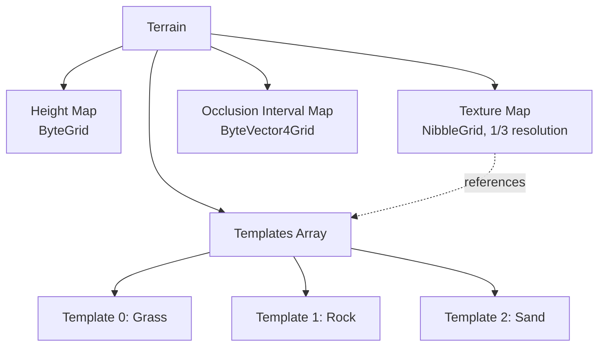

AlphaFramework's terrain system stores terrain data in a serializable format using <xref:AlphaFramework.World.Terrains.Terrain`1>. This allows terrain to be saved, loaded, and edited without requiring the rendering engine.

## Terrain Data Structure

The terrain system uses several components:

- **<xref:AlphaFramework.World.Terrains.ITerrain.HeightMap>** - A 2D grid of elevation values (0-255), one sample per terrain grid point
- **<xref:AlphaFramework.World.Terrains.ITerrain.TextureMap>** - Indices into the template array (0-15), at 1/3 the resolution of the height map
- **<xref:AlphaFramework.World.Terrains.ITerrain.OcclusionIntervalMap>** - Pre-calculated self-shadowing data
- Array of **<xref:AlphaFramework.World.Templates.TerrainTemplateBase`1>** - Objects that map texture indices to actual texture file paths


```mermaid
graph TD
    Terrain[Terrain<TTemplate>] --> HeightMap[Height Map<br/>ByteGrid]
    Terrain --> TextureMap[Texture Map<br/>NibbleGrid, 1/3 resolution]
    Terrain --> OcclusionMap[Occlusion Interval Map<br/>ByteVector4Grid]
    Terrain --> Templates[Templates Array]
    Templates --> Template1[Template 0: Grass]
    Templates --> Template2[Template 1: Rock]
    Templates --> Template3[Template 2: Sand]
    TextureMap -.references.-> Templates
```

> **Note:** Terrain dimensions (`TerrainSize.X` and `TerrainSize.Y`) must be multiples of 3, because the texture map resolution is exactly 1/3 of the height map resolution.

## Terrain Templates

Derive from `TerrainTemplateBase<>` to create your own terrain template type that maps texture indices to actual texture resources:

```csharp
public class TerrainTemplate : TerrainTemplateBase<TerrainTemplate>
{
    /// <summary>The texture to use for this terrain type</summary>
    public string Texture { get; set; }

    // Add additional properties as needed for your game
}
```

Templates associate texture indices in the texture map with actual texture files. Each template can define:
- Texture file path
- Display name
- Additional properties specific to your terrain type

## Converting to Renderable

Use the <xref:AlphaFramework.Presentation.TerrainExtensions.ToRenderable``1(AlphaFramework.World.Terrains.Terrain{``0},OmegaEngine.Engine,System.Boolean,System.Int32)> extension method to convert terrain data to a renderable format:

```csharp
// Load terrain data
var terrain = new Terrain<TerrainTemplate>(size: new(x: 300, y: 300, stretchH: 2.5f, stretchV: 0.5f));
terrain.LoadHeightMap("Maps/heightmap.dat");
terrain.LoadTextureMap("Maps/texturemap.dat");

// Define texture templates (up to 16)
terrain.Templates[0] = new() { Name = "Grass", Texture = "grass.png" };
terrain.Templates[1] = new() { Name = "Rock", Texture = "rock.png" };

// Convert to renderable for OmegaEngine
var renderable = terrain.ToRenderable(engine, lighting: true);
scene.Positionables.Add(renderable);
```

## API
