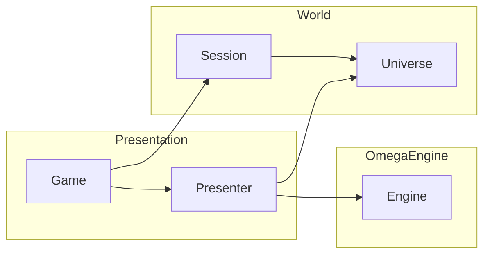

---
uid: AlphaFramework
summary: AlphaFramework is a high-level game framework built on top of OmegaEngine. It provides an architecture for managing game worlds, logic, and presentation. Its design emphasizes clean separation of responsibilities.
---

## Core concepts

AlphaFramework organizes game development into two domains:

### World layer

For building engine-agnostic models of game worlds.

- **Universe**: Defines static world data, describes what exists in the world  
- **Session**: Represents the current game state, tracks dynamic state and change

See <xref:AlphaFramework.World> for details.

### Presentation layer

- **Presenter**: Translates world state into renderable objects  
- **Game**: Manages the application lifecycle and orchestrates updates

See <xref:AlphaFramework.Presentation> for details.

## Additional resources

- **Project Templates**  
  Use the official [OmegaEngine templates](https://www.nuget.org/packages/OmegaEngine.Templates#readme-body-tab) to quickly scaffold a project using AlphaFramework.

- **Practical Examples**  
  See <xref:FrameOfReference> for real-world usage patterns and sample implementations.

## API
