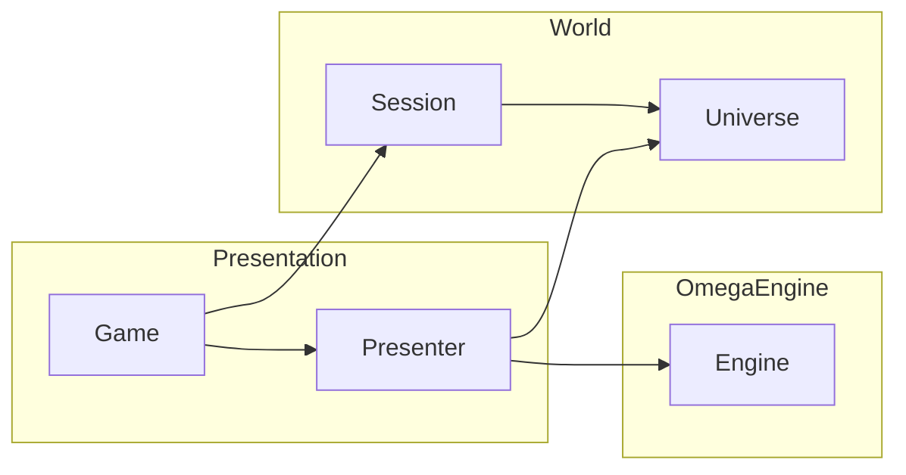

---
uid: AlphaFramework
summary: AlphaFramework is a high-level game framework built on top of OmegaEngine. It provides an architecture for managing game worlds, logic, and presentation. Its design emphasizes clean separation of responsibilities.
---
## Core concepts

AlphaFramework organizes game development into two domains:

### World layer

For building engine-agnostic models of game worlds.

- **Universe**: Defines static world data, describes what exists in the world  
- **Session**: Represents the current game state, tracks dynamic state and change

See <xref:AlphaFramework.World> for details.

### Presentation layer

- **Presenter**: Translates world state into renderable objects  
- **Game**: Manages the application lifecycle and orchestrates updates

See <xref:AlphaFramework.Presentation> for details.

```mermaid
flowchart LR
    subgraph World
        Universe
        Session
    end

    subgraph Presentation
        Presenter
        Game
    end

    subgraph OmegaEngine
        Engine
    end

    Session --> Universe
    Presenter --> Universe
    Presenter --> Engine
    Game --> Session
    Game --> Presenter
```

## Render hierarchy

Presenters can use the engine's [render hierarchy](https://docs.omegaengine.de/scenes.html#render-hierarchy) to group everything that belongs to one game world entity: its render components, selection highlights, lights and sounds. Moving an entity then only means writing its position and rotation to a single *anchor* node.

To do so, hand a <xref:AlphaFramework.Presentation.PivotedRenderables> to `ModelViewSync` instead of <xref:OmegaEngine.Graphics.Scene.Positionables>. It bridges the flat collections `ModelViewSync` works with and the hierarchy:

- `AddTo(renderable, entity)` puts a renderable into the entity's group.
- `AnchorFor(entity)` returns the node to write the entity's position and rotation to.
- `PivotFor(entity)` returns a <xref:OmegaEngine.Graphics.Renderables.Pivot> for lights and sounds to attach to.
- `PlaceUnder(renderable, parent)` places a renderable below an explicit parent instead, e.g. water planes below the terrain.

A group holding a single renderable, the common case of an entity with one mesh, needs no pivot: the renderable is a scene root and carries the entity's transform itself, with its own placement folded into `PreTransform`. Adding a second renderable or calling `PivotFor` promotes the group to a pivot without moving anything. Groups are never demoted. Releasing a group disposes only its pivot; the renderables stay owned by whoever added them.

A component's <xref:AlphaFramework.World.Components.Render.Shift> becomes the renderable's local `Position`, while its rotation and scale go into `PreTransform`. For <xref:AlphaFramework.World.Components.LightSource> and <xref:AlphaFramework.World.Components.Sound> components the shift becomes the `Offset` from the pivot they are attached to.

Because a lone renderable uses `Position` for the entity's world position, do not read it as the renderable's offset within the group. Use `LocalTransformOf(renderable)` instead.

## Additional resources

- **Project Templates**  
  Use the official [OmegaEngine templates](https://www.nuget.org/packages/OmegaEngine.Templates#readme-body-tab) to quickly scaffold a project using AlphaFramework.

- **Practical Examples**  
  See <xref:FrameOfReference> for real-world usage patterns and sample implementations.

## API
