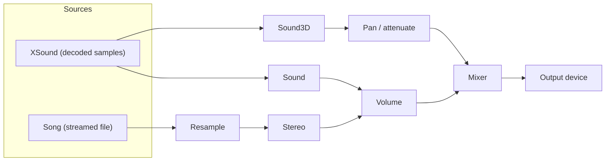

---
uid: OmegaEngine.Audio
summary: The audio subsystem plays back sound effects and background music.
---
## Output device and mixer

Each <xref:OmegaEngine.Engine> owns one <xref:OmegaEngine.Audio.AudioManager> (exposed as <xref:OmegaEngine.Engine.Audio>). It holds the shared NAudio output device and a mixer that all sounds and music feed into.

All inputs are mixed as 32-bit IEEE-float, stereo, at <xref:OmegaEngine.Audio.AudioManager.SampleRate> (44.1 kHz). Sources in other formats are resampled and converted to match before they reach the mixer.

## Sound effects

Sound effects are decoded up-front into an in-memory buffer of samples, so they can be triggered repeatedly and overlapped without re-reading the file.

- <xref:OmegaEngine.Assets.XSound> is the cached asset holding the decoded samples. Load it via <xref:OmegaEngine.Assets.XSound.Get(OmegaEngine.Engine,System.String)>.
- <xref:OmegaEngine.Audio.Sound> plays a sound non-positionally. Each call to <xref:OmegaEngine.Audio.Sound.StartPlayback(System.Boolean)> feeds an independent playback into the mixer, so the same asset can play multiple times at once.
- <xref:OmegaEngine.Audio.Sound3D> pans and attenuates a sound in stereo based on its <xref:OmegaEngine.Audio.Sound3D.Position> in world space relative to a listener.

The listener for 3D playback is whatever <xref:OmegaEngine.IViewpoint> is assigned to <xref:OmegaEngine.Audio.AudioManager.Listener>. Both <xref:OmegaEngine.Graphics.Cameras.Camera> and <xref:OmegaEngine.Graphics.View> implement that interface, so you can assign either; assigning the `View` is preferred because it delegates to whichever `Camera` is currently active, keeping the listener correct across camera swaps and transitions.

Games built on <xref:AlphaFramework.Presentation.PresenterBase`1> get this wiring for free. The presenter points the listener at its `View` when hooked in.

## Background music

<xref:OmegaEngine.Audio.Song> streams a music file from disk rather than decoding it fully into memory. <xref:OmegaEngine.Audio.MusicManager> (exposed as <xref:OmegaEngine.Engine.Music>) organizes songs into named *themes* and handles selection and cross-fading:

- <xref:OmegaEngine.Audio.MusicManager.AddSong(System.String,System.String[])> registers a song with one or more themes.
- <xref:OmegaEngine.Audio.MusicManager.PlayTheme(System.String)> starts a random song from a theme, fading out any currently playing song.
- <xref:OmegaEngine.Audio.MusicManager.Update> advances to the next song in the current theme once the previous one finishes.

If a file named `list.txt` is located in the `Music` content directory, it will automatically be parsed and used to populate the list of themes.

## Supported formats

Both sounds and songs infer the file format from the file ending:

- `.wav`
- `.mp3`
- `.m4a`
- `.wma`

## Signal chain

## API
