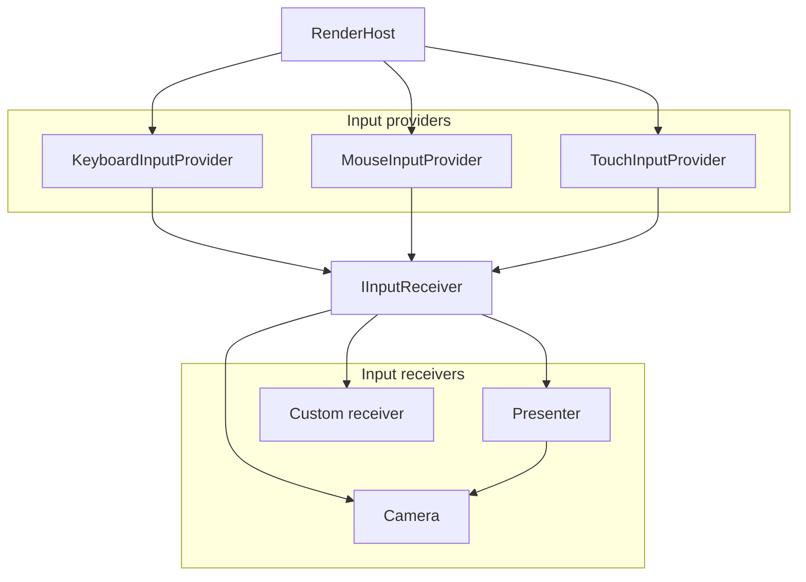

---
uid: OmegaEngine.Input
summary: OmegaEngine provides a flexible input system that processes low-level input events into higher-level navigational commands.
---
The input system uses a provider-receiver pattern:

- **<xref:OmegaEngine.Input.InputProvider>** - Captures raw input from devices (keyboard, mouse, touch) and translates it into semantic commands
- **<xref:OmegaEngine.Input.IInputReceiver>** - Receives and responds to input commands

## Input providers

### Keyboard

<xref:OmegaEngine.Input.KeyboardInputProvider> processes keyboard input for navigation and interaction.

The <xref:OmegaEngine.Input.KeyboardInputProvider.KeyBindings> property maps keyboard keys to translation and rotation commands. Default bindings include:

- **WASD** - Forward/backward and strafe left/right
- **QE** - Roll left/right
- **Arrow keys** - Pitch and yaw

You can customize the key bindings by modifying this dictionary.

### Mouse

<xref:OmegaEngine.Input.MouseInputProvider> processes mouse input for Camera control and selection.

The <xref:OmegaEngine.Input.MouseInputProvider.Scheme> property controls which mouse button does what using <xref:OmegaEngine.Input.MouseInputScheme>. Pre-defined schemes include:

- <xref:OmegaEngine.Input.MouseInputScheme.Scene> - Full 6DOF navigation (left: pan XY, right: rotate, middle: roll/zoom)
- <xref:OmegaEngine.Input.MouseInputScheme.Planar> - Top-down navigation (left: area select, right: pan XY, middle: rotate/zoom)
- <xref:OmegaEngine.Input.MouseInputScheme.FreeLook> - First-person style (left: look, right: move)

Each scheme maps mouse buttons to <xref:OmegaEngine.Input.MouseAction>s like navigation or area selection.

### Touch

<xref:OmegaEngine.Input.TouchInputProvider> processes touch input for gesture-based control.

## Input receivers

Classes that want to respond to input commands implement the <xref:OmegaEngine.Input.IInputReceiver> interface.

### Built-in receivers

All [Cameras](xref:OmegaEngine.Graphics.Cameras) implement the interface. This allows you to connect an input provider for direct movement control:

```csharp
var camera = new FreeFlyCamera();
inputProvider.AddReceiver(camera);
```

<xref:AlphaFramework.Presentation.PresenterBase`1> implements the interface. It passes `Navigate()` calls through to the <xref:OmegaEngine.Graphics.View.Camera>.

### Custom receivers

For custom input handling, you can implement <xref:OmegaEngine.Input.IInputReceiver> in your own code.

You can use the abstract base class <xref:OmegaEngine.Input.InputReceiverBase> to simplify the implementation. It allows you to override only the methods you wish to handle rather than implementing all of the interface methods.

```csharp
public class MyGameController : InputReceiverBase
{
    public override void Navigate(DoubleVector3 translation, DoubleVector3 rotation)
    {
        // Handle player movement
        player.Move(translation.X, translation.Z);
    }

    // ...
}

var controller = new MyGameController();
inputProvider.AddReceiver(controller);
```

## Usage with Hosting classes

<xref:OmegaEngine.RenderHost> and <xref:OmegaEngine.RenderPanel> automatically set up all built-in input providers.

You can register an input receiver with all of the providers with a single call to <xref:OmegaEngine.RenderHostExtensions.AddInputReceiver(OmegaEngine.IRenderHost,OmegaEngine.Input.IInputReceiver)>

## Overview



## API

