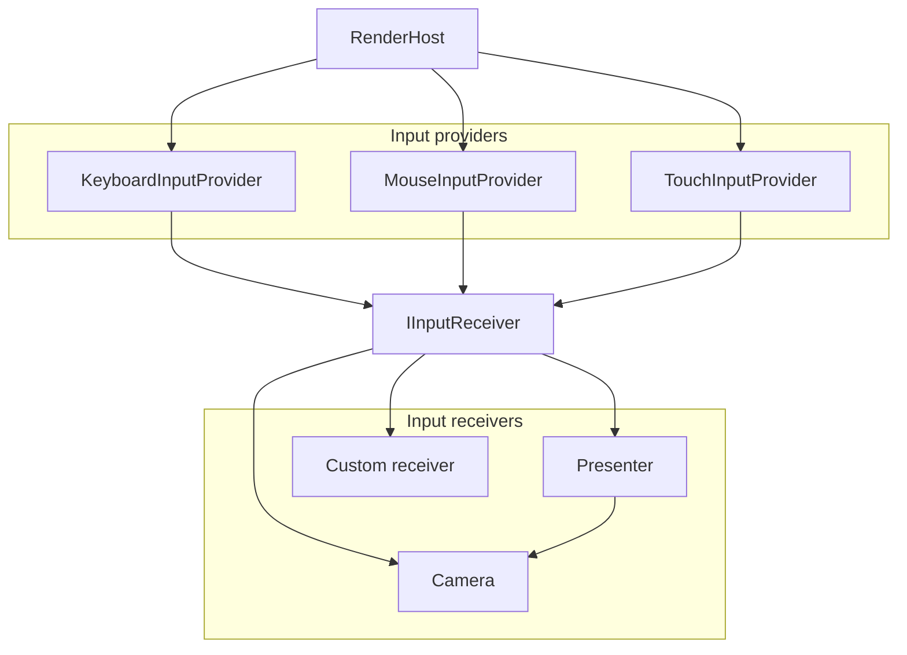

---
uid: OmegaEngine.Input
summary: *content
---
OmegaEngine provides a flexible input system that processes low-level input events into higher-level navigational commands. The system consists of <xref:OmegaEngine.Input.InputProvider>s that capture input and <xref:OmegaEngine.Input.IInputReceiver>s that respond to commands.

## Architecture

The input system uses a provider-receiver pattern:

- **<xref:OmegaEngine.Input.InputProvider>** - Captures raw input from devices (keyboard, mouse, touch) and translates it into semantic commands
- **<xref:OmegaEngine.Input.IInputReceiver>** - Receives and responds to input commands

## Input Providers

### <xref:OmegaEngine.Input.KeyboardInputProvider>

Processes keyboard input for navigation and interaction.

The <xref:OmegaEngine.Input.KeyboardInputProvider.KeyBindings> property maps keyboard keys to translation and rotation commands. Default bindings include:

- **WASD** - Forward/backward and strafe left/right
- **QE** - Roll left/right
- **Arrow keys** - Pitch and yaw

You can customize the key bindings by modifying this dictionary.

### <xref:OmegaEngine.Input.MouseInputProvider>

Processes mouse input for Cameraera control and selection.

The <xref:OmegaEngine.Input.MouseInputProvider.Scheme> property controls which mouse button does what using <xref:OmegaEngine.Input.MouseInputScheme>. Pre-defined schemes include:

- **Scene** - Full 6DOF navigation (left: pan XY, right: rotate, middle: roll/zoom)
- **Planar** - Top-down navigation (left: area select, right: pan XY, middle: rotate/zoom)
- **FreeLook** - First-person style (left: look, right: move)

Each scheme maps mouse buttons to <xref:OmegaEngine.Input.MouseAction>s like navigation or area selection.

### <xref:OmegaEngine.Input.TouchInputProvider>

Processes touch input for gesture-based control.

## Input Receivers

### <xref:OmegaEngine.Input.IInputReceiver>

Objects that want to respond to input commands implement this interface.

### Built-in receivers

All <xref:OmegaEngine.Graphics.Cameras> implement <xref:OmegaEngine.Input.IInputReceiver> and can be used directly:

```csharp
var Cameraera = new FreeFlyCameraera();
keyboardProvider.AddReceiver(Cameraera);
mouseProvider.AddReceiver(Cameraera);
```

TODO: PresenterBase implements IInputReceiver and forwards to View.Camera.

### Custom receivers

Implement <xref:OmegaEngine.Input.IInputReceiver> for custom input handling. You can use the abstract base class <xref:OmegaEngine.Input.InputReceiverBase> to simplify the implementation, if you don't want to handle all of the interface methods.

```csharp
public class MyGameController : InputReceiverBase
{
    public void Navigate(DoubleVector3 translation, DoubleVector3 rotation)
    {
        // Handle player movement
        player.Move(translation.X, translation.Z);
    }

    // ...
}

var controller = new MyGameController();
mouseProvider.AddReceiver(controller);
keyboardProvider.AddReceiver(controller);
```

## Usage with Hosting classes

Input providers are automatically created by hosting classes.

TODO: Simplify code samples

### With <xref:OmegaEngine.RenderHost>

```csharp
public class MyApp : RenderHost
{
    protected override bool Initialize()
    {
        if (!base.Initialize()) return false;

        var Cameraera = new FreeFlyCameraera();
        var view = new View(new Scene(), Cameraera);
        Engine.Views.Add(view);

        // Input providers are already created and active
        // Just add receivers
        KeyboardInputProvider.AddReceiver(Cameraera);
        MouseInputProvider.AddReceiver(Cameraera);

        return true;
    }
}
```

### With <xref:OmegaEngine.RenderPanel>

```csharp
var renderPanel = new RenderPanel();
// ... add to form ...

renderPanel.Setup(EngineConfig.Default);

var Cameraera = new ArcballCameraera();
var view = new View(new Scene(), Cameraera);
renderPanel.Engine.Views.Add(view);

// Access input providers from the panel
renderPanel.KeyboardInputProvider?.AddReceiver(Cameraera);
renderPanel.MouseInputProvider?.AddReceiver(Cameraera);
renderPanel.TouchInputProvider?.AddReceiver(Cameraera);
```

### With <xref:AlphaFramework.Presentation.GameBase>

GameBase provides input providers just like RenderHost:

```csharp
public class MyGame : GameBase
{
    protected override bool Initialize()
    {
        if (!base.Initialize()) return false;

        var presenter = new Presenter(Engine, universe);
        presenter.Initialize();

        // Connect input to the presenter's Cameraera
        KeyboardInputProvider.AddReceiver(presenter.View.Cameraera);
        MouseInputProvider.AddReceiver(presenter.View.Cameraera);
        TouchInputProvider.AddReceiver(presenter.View.Cameraera);

        return true;
    }
}
```


```mermaid
flowchart TD
    subgraph Providers["Input providers"]
        KeyboardInputProvider
        MouseInputProvider
        TouchInputProvider
    end

    subgraph Receivers["Input receivers"]
        Camera
        Presenter
        CustomReceiver["Custom receiver"]
    end

    RenderHost --> KeyboardInputProvider
    RenderHost --> MouseInputProvider
    RenderHost --> TouchInputProvider

    KeyboardInputProvider --> IInputReceiver
    MouseInputProvider --> IInputReceiver
    TouchInputProvider --> IInputReceiver

    IInputReceiver --> Camera
    IInputReceiver --> Presenter --> Camera
    IInputReceiver --> CustomReceiver
```
