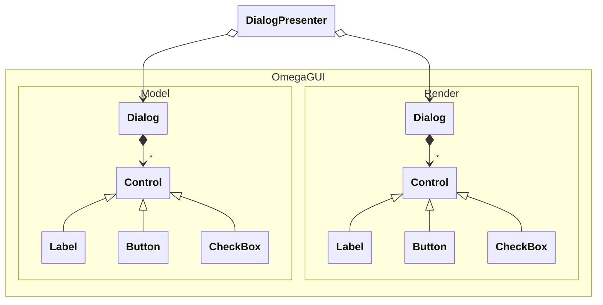

---
uid: OmegaGUI
summary: OmegaGUI is a GUI toolkit for OmegaEngine.
---
> [!NOTE]
> NuGet package: [OmegaGUI](https://www.nuget.org/packages/OmegaGUI/)

OmegaGUI is a texture-based 2D GUI toolkit with Lua scripting support. It provides a flexible system for creating interactive user interfaces with a Model-View separation pattern.

TODO: review

## Architecture

The GUI system uses a Model-View pattern with four key components:

- **<xref:OmegaGUI.Model>** - Defines the structure and data of GUI elements (dialogs, controls)
- **<xref:OmegaGUI.Render>** - Handles the actual rendering of GUI elements as textures
- **<xref:OmegaGUI.GuiManager>** - Manages all active dialogs and handles input/update cycles
- **<xref:OmegaGUI.DialogPresenter>** - Connects a Model dialog to its Render counterpart and manages the Lua scripting context

The Model namespace contains serializable definitions that can be saved to XML, while the Render namespace contains the runtime rendering implementations.



## XML storage

GUI definitions are stored in XML files using the <xref:OmegaGUI.Model> namespace classes. This allows dialogs to be designed visually in editors and loaded at runtime:

```csharp
// Load dialog from XML
var dialog = Dialog.FromContent("MainMenu.xml");

// Convert to renderable dialog
var dialogPresenter = new DialogPresenter(guiManager, dialog.ToRenderable(), lua: myLuaInstance);
dialogPresenter.Show();
```

The XML format defines the dialog structure, control layout, and properties.

> [!TIP]
> [AlphaEditor](xref:AlphaFramework.Editor) provides a WYSIWYG editor for creating and editing GUI dialogs visually.

## Scripting

OmegaGUI uses Lua for event handling and interactive behavior. Each dialog has its own Lua instance, providing script isolation between dialogs.

Control events (like button clicks) can execute Lua scripts specified in the `OnClick` property:

```csharp
var button = new Button
{
    Text = "Start Game",
    OnClick = "StartNewGame()" // Calls Lua function
};
```

The following .NET types and methods are automatically available in Lua scripts:
- Basic types: `string`, `int`, `float`, `bool`
- `System.Drawing.Color` - Color manipulation
- `System.Drawing.Point` - 2D coordinates
- Dialog-specific methods registered via the `Lua` instance passed to DialogPresenter

## Localization

OmegaGUI supports localization through resource strings. Control text properties can reference localization keys that are resolved at runtime based on the current culture.

Define localized strings in resource files, then reference them in your dialog XML using the standard resource key syntax.

## Theming

Controls are rendered using texture atlases loaded via the [storage system](xref:OmegaEngine.Foundation.Storage) from `GUI/Textures/THEMEName.png`. The default theme is `base`.

Create custom themes by:
1. Creating a texture atlas with the required control elements (see [texture atlas coordinates](#texture-atlas-coordinates))
2. Saving it as `GUI/Textures/YourThemeName.png`
3. Referencing the theme name in your GUI configuration

## Scaling

Dialogs are automatically scaled up when the screen height exceeds 1080 pixels (Full HD). This ensures GUI elements remain properly sized on high-resolution displays without requiring separate assets.

### Texture atlas coordinates

| Control      | Element            | Left | Top | Right | Bottom |
| ------------ | ------------------ | ---- | --- | ----- | ------ |
| Button       | Normal             | 0    | 0   | 136   | 54     |
|              | Hover              | 136  | 0   | 252   | 54     |
| CheckBox     | Box                | 0    | 54  | 27    | 81     |
|              | Check              | 27   | 54  | 54    | 81     |
| RadioButton  | Box                | 54   | 54  | 81    | 81     |
|              | Check              | 81   | 54  | 108   | 81     |
| DropdownList | Main               | 7    | 81  | 247   | 123    |
|              | Button             | 98   | 189 | 151   | 238    |
|              | Dropdown           | 13   | 123 | 241   | 160    |
|              | Selection          | 12   | 163 | 239   | 183    |
| Slider       | Track              | 1    | 187 | 93    | 228    |
|              | Button             | 151  | 193 | 192   | 234    |
| Scrollbar    | Track              | 196  | 212 | 218   | 223    |
|              | Up Arrow           | 196  | 192 | 218   | 212    |
|              | Down Arrow         | 196  | 223 | 218   | 244    |
|              | Button             | 220  | 192 | 238   | 234    |
| TextBox      | Text area          | 14   | 90  | 241   | 113    |
|              | Top left border    | 8    | 82  | 14    | 90     |
|              | Top border         | 14   | 82  | 241   | 90     |
|              | Top right border   | 241  | 82  | 246   | 90     |
|              | Left border        | 8    | 90  | 14    | 113    |
|              | Right border       | 241  | 90  | 246   | 113    |
|              | Lower left border  | 8    | 113 | 14    | 121    |
|              | Lower border       | 14   | 113 | 241   | 121    |
|              | Lower right border | 241  | 113 | 246   | 121    |
| Listbox      | Main               | 13   | 123 | 241   | 160    |
|              | Selection          | 16   | 166 | 240   | 183    |

## API
