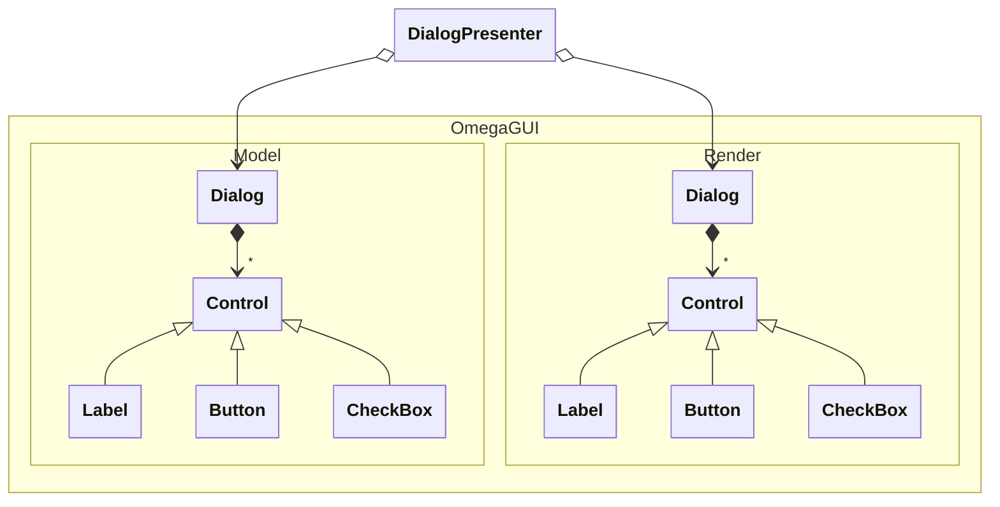

---
uid: OmegaGUI
summary: OmegaGUI is a GUI toolkit for OmegaEngine.
---
> [!NOTE]
> NuGet package: [OmegaGUI](https://www.nuget.org/packages/OmegaGUI/)
TODO: Describe OmegaGUI as texture-based 2D GUI toolkit with Lua scripting support.

TODO: Explain how <xref:OmegaGUI.GuiManager>, <xref:OmegaGUI.DialogPresenter>, <xref:OmegaGUI.Model> and <xref:OmegaGUI.Render> interact.


```mermaid
---
config:
  class:
    hideEmptyMembersBox: true
---
classDiagram
    namespace OmegaGUI.Model {
        class Model.Dialog["Dialog"]
        class Model.Control["Control"]
        class Model.Label["Label"]
        class Model.Button["Button"]
        class Model.CheckBox["CheckBox"]
    }

    namespace OmegaGUI.Render {
        class Render.Dialog["Dialog"]
        class Render.Control["Control"]
        class Render.Label["Label"]
        class Render.Button["Button"]
        class Render.CheckBox["CheckBox"]
    }

    DialogPresenter o--> Model.Dialog
    DialogPresenter o--> Render.Dialog

    Model.Dialog *--> "*" Model.Control
    Render.Dialog *--> "*" Render.Control

    Model.Control <|-- Model.Label
    Model.Control <|-- Model.Button
    Model.Control <|-- Model.CheckBox

    Render.Control <|-- Render.Label
    Render.Control <|-- Render.Button
    Render.Control <|-- Render.CheckBox
```


## XML storage

Load GUI definitions from XML files in the <xref:OmegaGUI.Model> namespace:

```csharp
// Load dialog from XML
var dialog = Dialog.FromContent("MainMenu.xml");

// Convert to renderable dialog
var dialogPresenter = new DialogPresenter(guiManager, dialog.ToRenderable(), lua: myLuaInstance);
dialogPresenter.Show();
```

TODO: Explain more

> [!TIP]
> [AlphaEditor](xref:AlphaFramework.Editor) provides a WYSIWYG editor for creating and editing GUI dialogs visually.

## Scripting

TODO: Explain event handling with Lua scripts, mention that each dialog has it's own instance, list which .NET types and methods get mapped in by default

## Localization

TODO: Explain how localization in OmegaGUI works

## Theming

TODO: Explain that controls are rendered using texture atlas loaded via [storage system](xref:OmegaEngine.Foundation.Storage) from `GUI/Textures/THEMEName.png` with  `base` being the default theme name.

## Scaling

TODO

### Texture atlas coordinates

| Control      | Element            | Left | Top | Right | Bottom |
| ------------ | ------------------ | ---- | --- | ----- | ------ |
| Button       | Normal             | 0    | 0   | 136   | 54     |
|              | Hover              | 136  | 0   | 252   | 54     |
| CheckBox     | Box                | 0    | 54  | 27    | 81     |
|              | Check              | 27   | 54  | 54    | 81     |
| RadioButton  | Box                | 54   | 54  | 81    | 81     |
|              | Check              | 81   | 54  | 108   | 81     |
| DropdownList | Main               | 7    | 81  | 247   | 123    |
|              | Button             | 98   | 189 | 151   | 238    |
|              | Dropdown           | 13   | 123 | 241   | 160    |
|              | Selection          | 12   | 163 | 239   | 183    |
| Slider       | Track              | 1    | 187 | 93    | 228    |
|              | Button             | 151  | 193 | 192   | 234    |
| Scrollbar    | Track              | 196  | 212 | 218   | 223    |
|              | Up Arrow           | 196  | 192 | 218   | 212    |
|              | Down Arrow         | 196  | 223 | 218   | 244    |
|              | Button             | 220  | 192 | 238   | 234    |
| TextBox      | Text area          | 14   | 90  | 241   | 113    |
|              | Top left border    | 8    | 82  | 14    | 90     |
|              | Top border         | 14   | 82  | 241   | 90     |
|              | Top right border   | 241  | 82  | 246   | 90     |
|              | Left border        | 8    | 90  | 14    | 113    |
|              | Right border       | 241  | 90  | 246   | 113    |
|              | Lower left border  | 8    | 113 | 14    | 121    |
|              | Lower border       | 14   | 113 | 241   | 121    |
|              | Lower right border | 241  | 113 | 246   | 121    |
| Listbox      | Main               | 13   | 123 | 241   | 160    |
|              | Selection          | 16   | 166 | 240   | 183    |

## API
