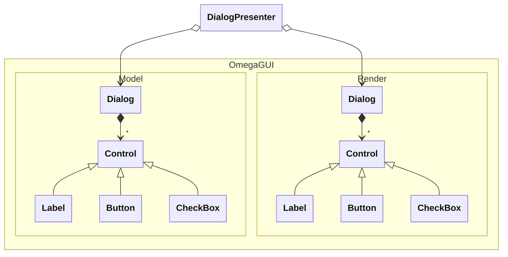

---
uid: OmegaGUI
summary: OmegaGUI is a GUI toolkit for OmegaEngine.
---
> [!NOTE]
> NuGet package: [OmegaGUI](https://www.nuget.org/packages/OmegaGUI/)

OmegaGUI is a texture-based 2D GUI toolkit with Lua scripting support. It provides a flexible system for creating interactive user interfaces with a Model-View separation pattern.

## Architecture

The GUI system uses a Model-View pattern with four key components:

- **<xref:OmegaGUI.Model>** - Defines the structure and data of GUI elements (dialogs, controls)
- **<xref:OmegaGUI.Render>** - Handles the actual rendering of GUI elements as textures
- **<xref:OmegaGUI.GuiManager>** - Manages all active dialogs and handles input/update cycles
- **<xref:OmegaGUI.DialogPresenter>** - Connects a Model dialog to its Render counterpart and manages the Lua scripting context

The Model namespace contains serializable definitions that can be saved to XML, while the Render namespace contains the runtime rendering implementations.


```mermaid
---
config:
  class:
    hideEmptyMembersBox: true
---
classDiagram
    namespace OmegaGUI.Model {
        class Model.Dialog["Dialog"]
        class Model.Control["Control"]
        class Model.Label["Label"]
        class Model.Button["Button"]
        class Model.CheckBox["CheckBox"]
    }

    namespace OmegaGUI.Render {
        class Render.Dialog["Dialog"]
        class Render.Control["Control"]
        class Render.Label["Label"]
        class Render.Button["Button"]
        class Render.CheckBox["CheckBox"]
    }

    DialogPresenter o--> Model.Dialog
    DialogPresenter o--> Render.Dialog

    Model.Dialog *--> "*" Model.Control
    Render.Dialog *--> "*" Render.Control

    Model.Control <|-- Model.Label
    Model.Control <|-- Model.Button
    Model.Control <|-- Model.CheckBox

    Render.Control <|-- Render.Label
    Render.Control <|-- Render.Button
    Render.Control <|-- Render.CheckBox
```

## XML storage

GUI definitions are stored in XML files using the <xref:OmegaGUI.Model> namespace classes. This allows dialogs to be designed visually in editors and loaded at runtime:

```csharp
// Load dialog from XML
var dialog = Dialog.FromContent("MainMenu.xml");

// Convert to renderable dialog
var dialogPresenter = new DialogPresenter(guiManager, dialog.ToRenderable(), lua: myLuaInstance);
dialogPresenter.Show();
```

> [!TIP]
> [AlphaEditor](xref:AlphaFramework.Editor) provides a WYSIWYG editor for creating and editing GUI dialogs visually.

## Scripting

OmegaGUI uses Lua for event handling and interactive behavior. Each dialog has its own Lua instance.

Control events (like button clicks) can execute Lua scripts specified in the `OnClick` property:

```csharp
var button = new Button
{
    Text = "Start Game",
    OnClick = "StartNewGame()" // Calls Lua function
};
```

When a `Lua` instance is passed to <xref:OmegaGUI.DialogPresenter>, all named controls in the dialog are automatically registered as Lua variables using their `Name` property. The presenter itself is also available as `Me`. Event properties such as `OnClick` specify Lua code strings that are executed in this context when the event fires.

## Localization

OmegaGUI supports localization through XML `.locale` files stored in `GUI/Language/` in the content directory. Control text properties use a `[Key]` syntax to reference locale entries:

```xml
<Button Text="[StartGame]" />
```

At runtime the `[Key]` is replaced by the matching entry from the active language file (e.g. `English.locale`, `German.locale`). The language is selected based on `Resources.Culture`; if no matching file exists the engine falls back to English, then German, then the raw key string.

## Theming

Controls are rendered using texture atlases loaded via the [storage system](xref:OmegaEngine.Foundation.Storage) from `GUI/Textures/<YourThemeName>.png`. The default theme is `base`.

Create custom themes by:
1. Creating a texture atlas with the required control elements (see [texture atlas coordinates](#texture-atlas-coordinates))
2. Saving it as `GUI/Textures/<YourThemeName>.png`
3. Referencing the theme name in your GUI configuration

### Texture atlas coordinates

| Control      | Element            | Left | Top | Right | Bottom |
| ------------ | ------------------ | ---- | --- | ----- | ------ |
| Button       | Normal             | 0    | 0   | 136   | 54     |
|              | Hover              | 136  | 0   | 252   | 54     |
| CheckBox     | Box                | 0    | 54  | 27    | 81     |
|              | Check              | 27   | 54  | 54    | 81     |
| RadioButton  | Box                | 54   | 54  | 81    | 81     |
|              | Check              | 81   | 54  | 108   | 81     |
| DropdownList | Main               | 7    | 81  | 247   | 123    |
|              | Button             | 98   | 189 | 151   | 238    |
|              | Dropdown           | 13   | 123 | 241   | 160    |
|              | Selection          | 12   | 163 | 239   | 183    |
| Slider       | Track              | 1    | 187 | 93    | 228    |
|              | Button             | 151  | 193 | 192   | 234    |
| Scrollbar    | Track              | 196  | 212 | 218   | 223    |
|              | Up Arrow           | 196  | 192 | 218   | 212    |
|              | Down Arrow         | 196  | 223 | 218   | 244    |
|              | Button             | 220  | 192 | 238   | 234    |
| TextBox      | Text area          | 14   | 90  | 241   | 113    |
|              | Top left border    | 8    | 82  | 14    | 90     |
|              | Top border         | 14   | 82  | 241   | 90     |
|              | Top right border   | 241  | 82  | 246   | 90     |
|              | Left border        | 8    | 90  | 14    | 113    |
|              | Right border       | 241  | 90  | 246   | 113    |
|              | Lower left border  | 8    | 113 | 14    | 121    |
|              | Lower border       | 14   | 113 | 241   | 121    |
|              | Lower right border | 241  | 113 | 246   | 121    |
| Listbox      | Main               | 13   | 123 | 241   | 160    |
|              | Selection          | 16   | 166 | 240   | 183    |

## Scaling

TODO: Review

Dialogs can be scaled through several mechanisms:

- **<xref:OmegaGUI.Model.Dialog.FontSize>** - Controls the default font size for all text in the dialog. Larger values make text bigger.
- **<xref:OmegaGUI.Model.Dialog.Scale>** - A multiplier applied to all dialog dimensions and positions. Values greater than 1.0 enlarge the dialog.
- **<xref:OmegaGUI.Model.Dialog.Fullscreen>** - When `true` and `Size` is set, the dialog is uniformly scaled to fill the screen while maintaining its aspect ratio. When `Size` is empty the dialog simply covers the full render area.

### Automatic scaling

Dialogs without `Fullscreen` are automatically scaled up when the render height exceeds 1080 pixels (Full HD). The <xref:OmegaGUI.DialogPresenter> calculates an auto-scale factor: `max(1, renderHeight / 1080)`. This ensures that GUI elements remain appropriately sized on high-resolution displays (e.g., 4K monitors) without requiring separate assets or manual configuration.

Example: On a 2160p (4K) display, dialogs are automatically scaled by a factor of 2.0, making them twice as large to maintain readability.

## API
